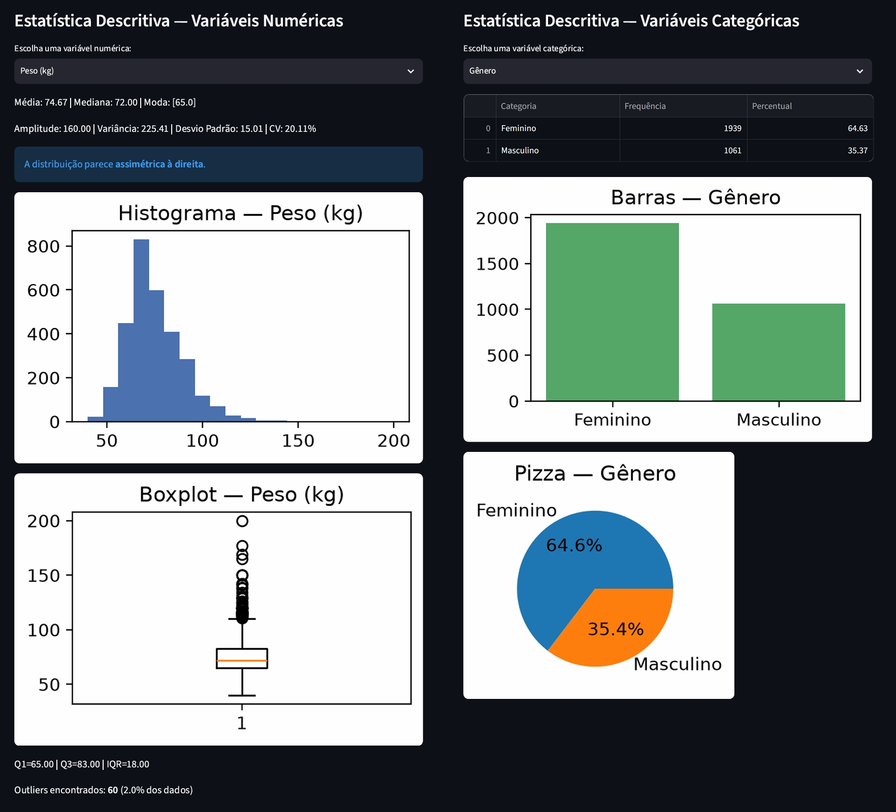
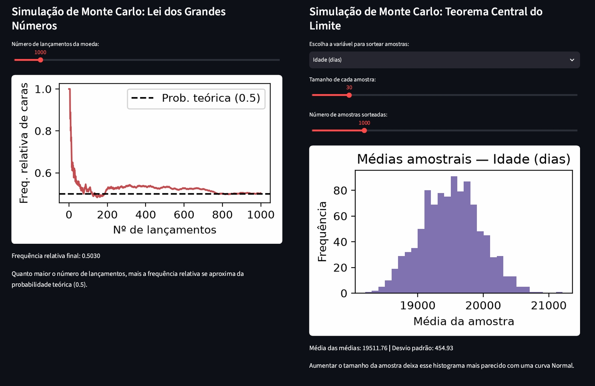
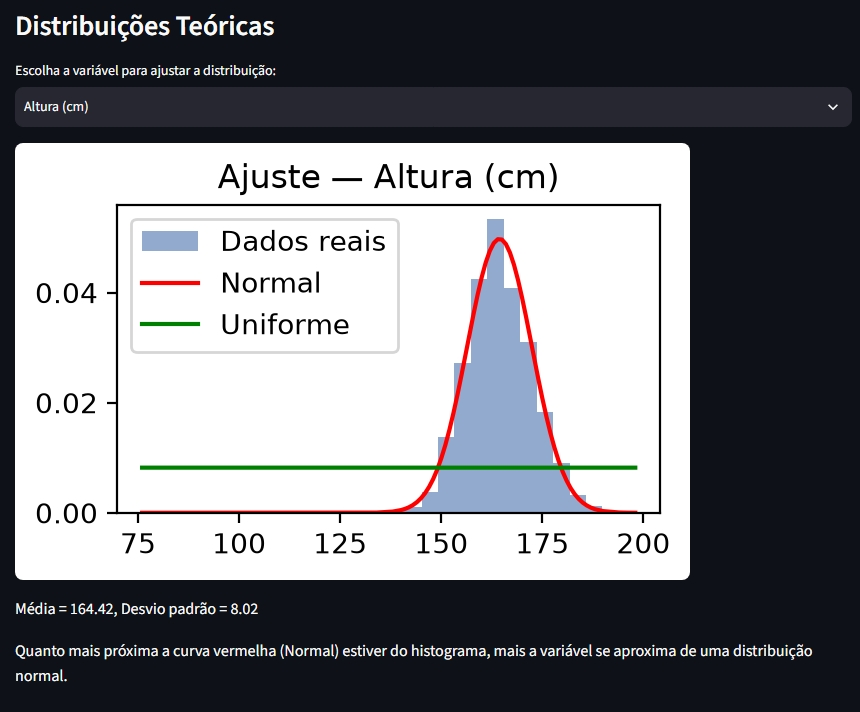
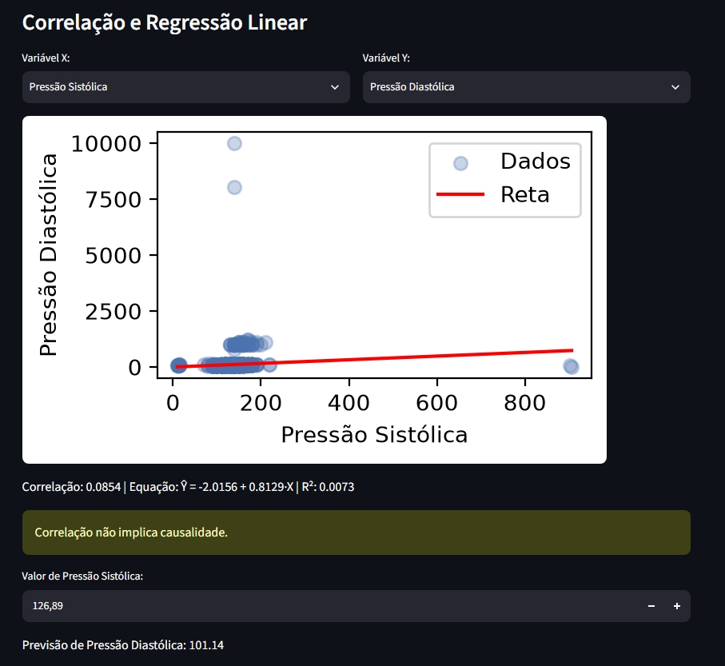

# Laboratório Estatístico Interativo

**Equipe:** Atividade individual

| Nome completo | Matrícula | Frente principal |
|---------------|-----------|------------------|
| Jhéssica de Moura Lima | 72650126 | Núcleo estatístico, interface, simulações, distribuições, regressão, relatório e vídeo |

**Dataset:** Cardiovascular Disease Dataset · fonte original: [kaggle.com/datasets/sulianova/cardiovascular-disease-dataset](https://www.kaggle.com/datasets/sulianova/cardiovascular-disease-dataset)

**Vídeo:** https://youtu.be/QseYhAMAZ9o 

## Como rodar

```bash
# 1. criar e ativar o ambiente virtual
python -m venv .venv
.venv\Scripts\activate          # Windows
source .venv/bin/activate       # Linux / Mac

# 2. instalar as dependências
pip install -r requirements.txt

# 3. rodar os testes do núcleo (todos devem passar)
pytest testes/ -v

# 4. rodar a aplicação
streamlit run app/app.py
```

## Estrutura

```
app/app.py              interface (Streamlit) — só exibe o que o núcleo calcula
nucleo/minhastats.py    NÚCLEO: funções estatísticas implementadas do zero, sem NumPy nas contas
testes/test_minhastats.py  testes pytest comparando com NumPy/SciPy
dados/cardio_train.csv  o dataset
RELATORIO.md            relatório final
requirements.txt        dependências
```

## Como calculei as estatísticas

Implementei todas as funções estatísticas manualmente em `nucleo/minhastats.py`, sem usar funções prontas (`np.mean`, `statistics.stdev` e afins) — apenas operações básicas de Python (`sum`, `len`, `sorted`, `min`, `max`). Usei NumPy, Pandas e SciPy só para: carregar e organizar os dados (Pandas), validar meus resultados nos testes automatizados (NumPy) e desenhar as curvas teóricas de referência no Módulo 4 (SciPy).

## Prints da aplicação

# - Módulo 2 — Descritiva: 


# - Módulo 3 — Simulação: 


# - Módulo 4 — Distribuições: 


# - Módulo 5 — Regressão: 
